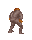

# xcom-editor

This is both a library to load image resources for the game [UFO: Enemy Unknown](https://en.wikipedia.org/wiki/UFO:_Enemy_Unknown)
and a savegame editor (wip). 

## Loading game images

All images are stored in a custom format (see https://www.ufopaedia.org/index.php/Image_Formats for more information).

Here is an example how you can extract the images from `ZOMBIE.PCK` to create an animated GIF:

```go
package main

import (
    "image/gif"
    "os"
    
    "github.com/redtoad/xcom-editor/resources"
)

func main() {
    // load all game palettes 
    palettes, _ := resources.LoadPalettes("GEODATA/PALETTES.DAT")

    // load image data from .PCK (all offsets are stored in .TAB file)
    offsets, _ := resources.LoadTAB("UNITS/ZOMBIE.TAB", 2)
    collection, _ := resources.LoadImageCollectionFromPCK("UNITS/ZOMBIE.PCK", 32, offsets)
    
    // convert to animated gif
    animated := collection.Animated(25, 40, palettes[4])
    f, _ := os.Create("zombie.gif")
    _ = gif.EncodeAll(f, animated)
}
```

The result is:




